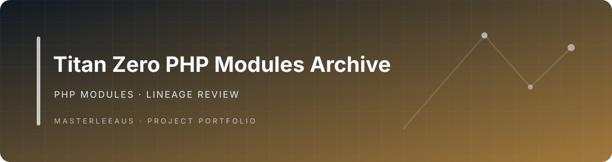

# Titan Zero PHP Modules Archive

**A PHP codebase exploring Titan Zero services and platform components.**

> **Status: exploratory repository; relationship to the canonical platform unverified.** The inspected default branch contains PHP source directories including AI, actions, contracts, database, events, HTTP, and integration-related components. No dependency manifest or automated verification command was identified in the root inventory.

## Relationship to the active product

The current field-service product is [Titan Zero Field Service Workforce](https://github.com/Masterleeaus/Titan-Zero-Field-Service-Workforce). This repository should be treated as a separate experiment or source archive until its history and implementation are compared with the canonical product.

## Contents

- `AI/` — AI-related code
- `Actions/` — action definitions
- `Contracts/` — contracts
- `Database/` — database-related code
- `Events/` — event code
- `Http/` — HTTP layer
- Additional PHP source directories

## Development status

A Composer manifest, supported installation workflow, test command, license, and release artifact were not verified in the inspected root. Add and verify these before presenting the repository as installable or production-ready.

## Portfolio classification

**Lineage review required.** Compare with `TitanCore`, `Titan-BOS`, `zero`, and the current workforce repo. Preserve it only as a distinct project or attributable source snapshot; otherwise migrate unique material to its canonical destination and mark it for retirement.

## Banner

No verified project-specific banner was found during this review.
