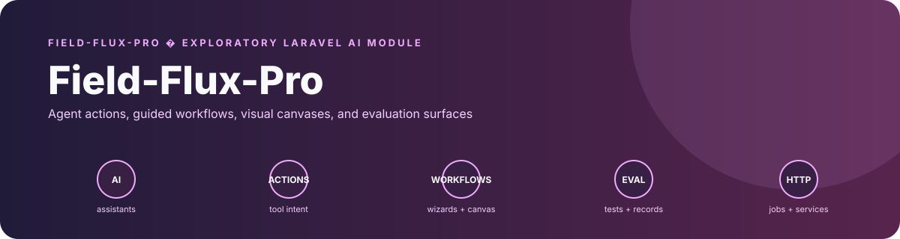
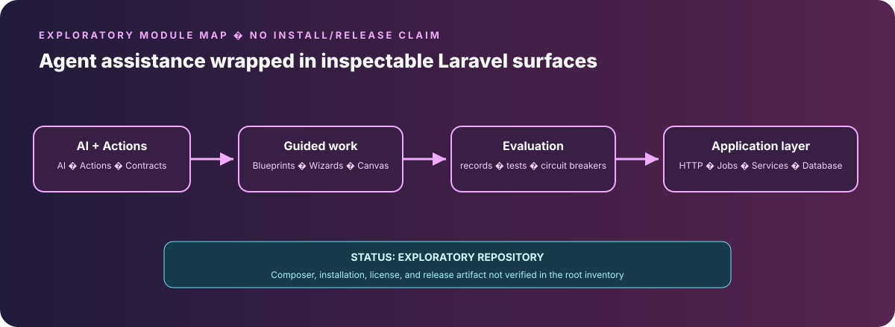

<div align="center">

# Field-Flux-Pro

**Titan Zero Laravel AI modules for service workflows**

</div>

## Overview

Field-Flux-Pro contains the Titan Zero PHP/Laravel module set for AI-assisted service workflows. It brings agent actions, standards-grounded assistance, circuit protection, visual workflows, evaluation, and platform administration into a Laravel module boundary.


## Measured evidence

Field-Flux-Pro has a bounded but useful source-level verification surface around evaluation, tenant safety and resilience.

| Focused test file | Test methods present | What it covers |
| --- | ---: | --- |
| `Tests/Feature/EvaluationScoringTest.php` | **4** | persisted scores, tenant scoping, hallucination penalty and score bounds |
| `Tests/Architecture/CrossTenantArchitectureTest.php` | **15** | required control classes, cross-tenant mismatch rejection and company-scoped entities |
| `Tests/Feature/CircuitBreakerIntegrationTest.php` | **3** | sustained-failure trip, success path and single-event behavior after opening |
| Focused methods across these files | **22** | evaluation + tenant + resilience evidence |

This is **source and test-structure evidence**, not a clean-checkout result. The repository is a host Laravel module/archive and this pass did not establish a synchronized lockfile, installed host or green full suite.

## What is new

The module's technical signature is an **inspectable AI service layer where evaluation, invocation logging, tenant scope and circuit protection are separate persisted concerns**.

```text
Agent / workflow request
       ↓
Company-scoped action path
       ↓
Tool invocation
       ├── invocation log
       ├── circuit state
       └── workflow evidence
       ↓
Result
       ↓
Agent evaluation record
```

That makes AI behavior easier to audit than a single opaque conversation transcript: evaluation scores, tool hashes/durations, tenant identifiers, circuit events and workflow runs have explicit implementation surfaces.

The strongest portfolio value is the way the module makes AI behavior inspectable: prompts and tools sit beside action code, tenant boundaries are represented in models and tests, and agent quality is recorded as evaluation data rather than treated as an invisible chat response.

<p align="center">
  
</p>

## Verified capabilities

- **Agent evaluation:** `Evaluation/AgentEvaluator.php` scores task completion, tool accuracy, response latency, and a weighted composite; its hallucination flag uses caller-supplied forbidden strings and response heuristics before persisting `company_id`, agent, session, and response snapshot.
- **Tenant and action safety:** `Tests/Architecture/CrossTenantArchitectureTest.php` checks the CrossTenantGuard, ToolInvocationLogger, evaluation entities, circuit breaker, and workflow classes; it also asserts cross-tenant mismatch rejection and company-scoped fillable fields.
- **Invocation observability:** `Services/ToolInvocationLogger.php` records company, agent, tool, parameter/result hashes, and duration for tool calls.
- **Resilient workflows:** `Services/CircuitBreaker/CircuitBreakerService.php` and its integration tests model failure windows and tripping behavior around provider or action paths.
- **Visual workflow execution:** `Canvas/Entities/CanvasWorkflow.php`, `CanvasWorkflowRun.php`, and `Canvas/Actions/ExecuteCanvasWorkflowAction.php` provide persisted tenant-scoped workflow definitions and execution records.
- **Manifest-backed module surface:** `module.json` declares retrieval, guardrail, citation, and AI-tool manifest paths alongside workspace, canvas, chat, workflow, and collaboration capabilities.

## Architecture and code map

| Area | Responsibility |
| --- | --- |
| `AI/` | AI-related assets, retrieval/guardrail/citation material, and orchestration inputs. |
| `Actions/` | Agent and application actions. |
| `Canvas/` | Tenant-scoped visual workflow definitions and execution records. |
| `Evaluation/` | Agent scoring and persisted evaluation results. |
| `Services/` | Tool logging, circuit breaker, standards assistance, and platform services. |
| `Http/`, `Jobs/`, `Events/` | Request paths, asynchronous work, and domain events. |
| `Tests/` | Architecture, unit, feature, and contract-oriented verification. |

## Reproducible verification

Focused evidence includes:

- `Tests/Feature/EvaluationScoringTest.php` for persistence, tenant separation, hallucination penalty, and score bounds.
- `Tests/Feature/CanvasWorkflowTest.php` for workflow creation and execution.
- `Tests/Feature/CircuitBreakerIntegrationTest.php` for tripping behavior.
- `Tests/Architecture/CrossTenantArchitectureTest.php` for architecture and tenant invariants.
- `Tests/Feature/StandardsGroundedAssistTest.php` for standards-grounded assistance routing.

## Installation and host integration

The repository root contains a module `composer.json` for `workdo/aiassistant` with the `Modules\\TitanZero\\` PSR-4 mapping and `orhanerday/open-ai` dependency. It is intended for a host Laravel application rather than a standalone product:

```bash
composer install
php artisan module:seed TitanZero
```

These commands are source-described integration steps; a synchronized lockfile and clean-checkout run were not verified in this portfolio pass.

## Scope and provenance

Treat Field-Flux-Pro as an exploratory module/archive until its lineage, dependency policy, and relationship to [Titan Zero Field Service Workforce](https://github.com/Masterleeaus/Titan-Zero-Field-Service-Workforce) are independently reconciled. The `composer.json` identifies the package as `workdo/aiassistant` and names WorkDo as author; preserve that attribution and do not present the repository as unqualified original work.

The code demonstrates real AI/platform integration patterns, but this README does not claim a current production release, clean-checkout test pass, or universal capability across every retained artifact.